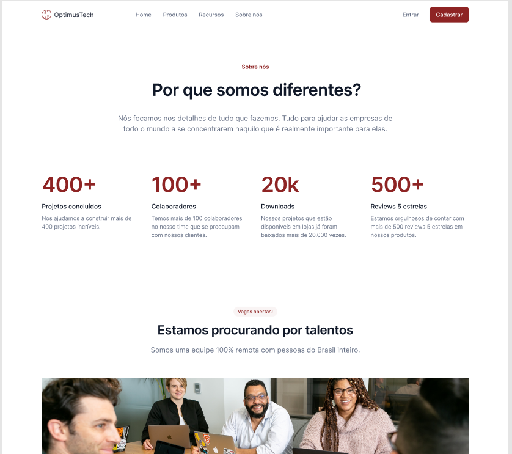

<h1 align="center">
  
</h1>

  <a href="#-projeto">Projeto</a>&nbsp;&nbsp;&nbsp;|&nbsp;&nbsp;&nbsp;
  <a href="#-tecnologias">Tecnologias</a>
 

 

<h2 align="center"></h2>

 

  

 

## 💻 Projeto

7DaysOfCode é um evento da Alura divido em 7 desafios diários de desenvolvimento, o intuito de exercitar os conhecimentos em várias áreas como Lógica com Javascript, React, Java, HTML e CSS, JavaScript e DOM, Ciência de dados, Windows Forms, Responsividade e Python!

 

## ✨ Tecnologias

Esse projeto foi desenvolvido com as seguintes tecnologias:

- HTML
- CSS

---
